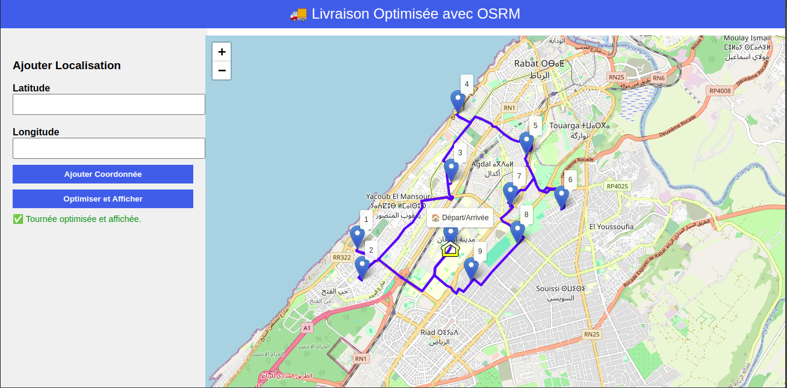

# 🚚 Delivery Route Optimization System

**An intelligent route planning solution** for small businesses using:
- **OSRM** routing engine
- **FastAPI** (backend API)
- **Leaflet.js** (interactive map)
- **Docker** containerization

  

## 🌟 Key Features
- Optimized delivery routes for **Morocco** (easily adaptable to other countries)
- Designed for small businesses and local logistics
- Interactive map visualization
- Docker-based deployment

## 📋 Prerequisites

- Docker 🐳 + Docker Compose
- Python 3.11+ (for local development)

## 🛠 Installation

```bash
# 1. Clone repository
git clone https://github.com/salmanebaba/LivraisonTrajet.git
cd LivraisonTrajet

# 2. Create maps directory (required)
mkdir -p maps && touch maps/.gitkeep

# 3. Start services (first time)
docker compose up --build
```
```bash
# Then u can just use:
docker compose up
```
- You can see the results here:     http://localhost:8080


## Workflow:

- Add delivery points via map clicks or manual input

- Click "Optimize Route"

- View optimized path with sequence numbers

## 🌍 Multi-Country Support
- While pre-configured for Morocco, you can easily adapt to other countries:

- Modify REGION="morocco" in osrm/osrm-init.sh

- Choose from [Geofabrik's regional datasets](https://download.geofabrik.de/)

- Follow the installation steps again
